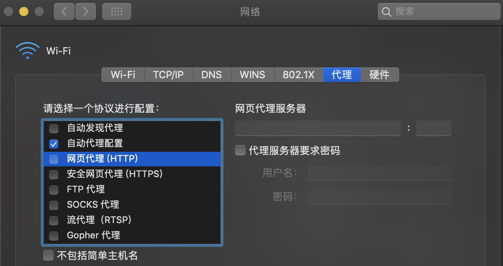
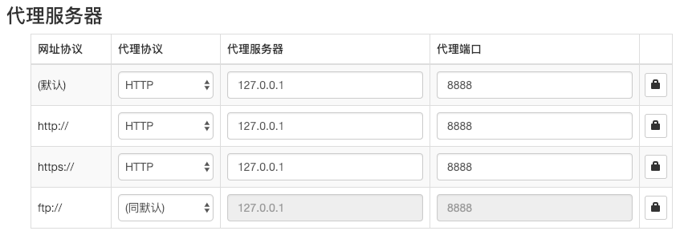

# node-transport-proxy

[](./LICENSE)
[](https://www.npmjs.com/package/node-transport-proxy)
[](https://www.npmjs.com/package/node-transport-proxy)
[](https://circleci.com/gh/Lighting-Jack/node-transport-proxy/tree/master)

node 透明代理  转发。支持 http,https,ws,wss。

[中文版文档](./README.md)

## Installation

```
npm install node-transport-proxy -g
```

## Quick Start

```
ntp start
```

这样 ntp 已经监听默认端口`8888`，代理服务可以正常使用了。可以通过`curl www.qq.com -x 127.0.0.1:8888`试验代理效果。

## Usage

```
ntp <command> [options]
```

如何把浏览器的请求都通过 ntp 服务进行转发呢？下面给出几个例子

- 配置系统全局的 web 代理<br/>
  以 macOS 为例<br/>
  `打开网络偏好设置`->`高级`->`代理`， 勾选网页代理(http)和安全网页代理(https)，然后  在 host 和 port 处都填上你的 ntp 服务监听的 host 和 port 就可以了。
  
- 配置浏览器的 web 代理<br/>
  以 chrome 浏览器为例<br/>
  1. 安装 chrome 浏览器插件[Proxy SwitchyOmega](https://chrome.google.com/webstore/detail/proxy-switchyomega/padekgcemlokbadohgkifijomclgjgif)
  2. 配置[Proxy SwitchyOmega](https://chrome.google.com/webstore/detail/proxy-switchyomega/padekgcemlokbadohgkifijomclgjgif)<br/>
     

## Command Reference

- start [options] 启动 ntp 代理服务
- stop 停止 ntp 代理服务
- restart 重启 ntp 代理服务
- status 显示目前后台正在运行的 ntp 代理服务

## Options Reference

- host
- port
- proxy

## TODO LIST

- [ ] 支持 socks4,socks5 代理转发 
- [ ] 支持代理验证

## Licence

[MIT](./LICENSE)
